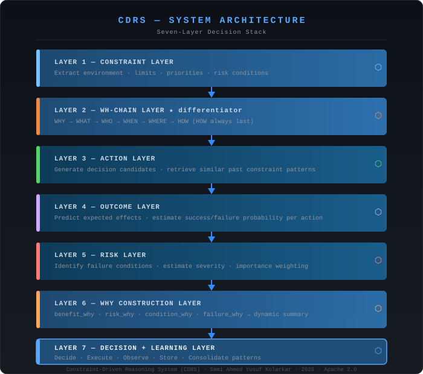
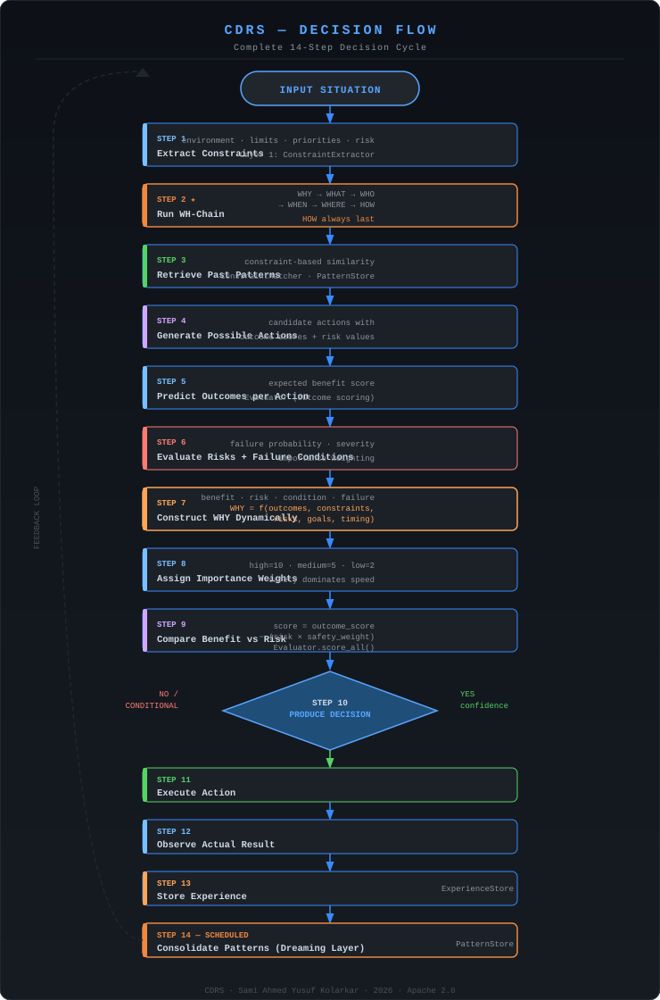
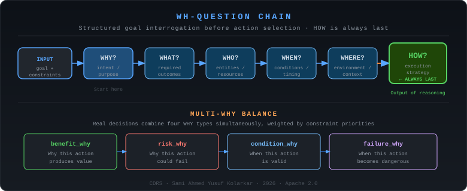
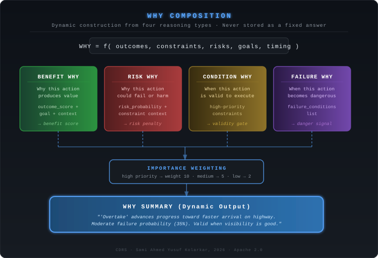
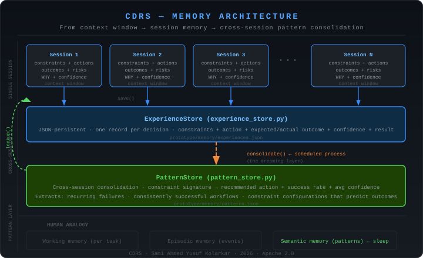
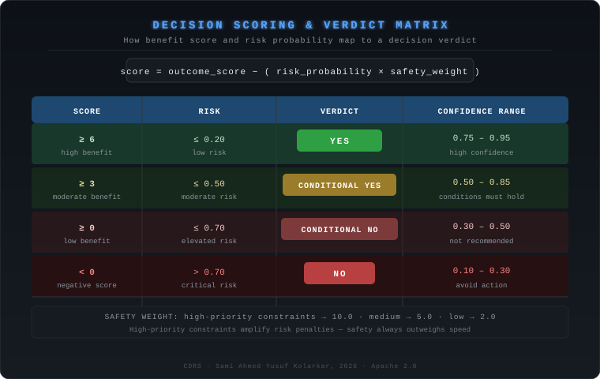

# CDRS Diagrams

Visual reference for the Constraint-Driven Reasoning System architecture.  
All SVGs render directly on GitHub. Open any file for full-resolution view.

---

## 1. System Architecture — Seven Layers

**File:** `system_architecture.svg`

The complete 7-layer decision stack from constraint extraction through learning.  
Use this as the primary architectural reference.

---

## 2. Decision Flow — Complete 14-Step Cycle

**File:** `decision_flow.svg`

Every step from input situation through pattern consolidation,  
with layer labels and component names at each stage.

---

## 3. WH-Question Chain

**File:** `wh_chain.svg`

The primary CDRS differentiator.  
Shows WHY → WHAT → WHO → WHEN → WHERE → HOW with HOW always derived last.

---

## 4. WHY Composition — Dynamic Construction

**File:** `why_composition.svg`

How WHY is assembled from four components:  
benefit_why, risk_why, condition_why, failure_why → summary.

---

## 5. Memory and Learning Layers

**File:** `memory_layers.svg`

Session memory → cross-session experience store → pattern consolidation (dreaming layer).  
Shows how learning persists and compounds across decision cycles.

---

## 6. Verdict Matrix

**File:** `verdict_matrix.svg`

How score and risk combine to produce:  
YES / CONDITIONAL YES / CONDITIONAL NO / NO + confidence range.

---

## 7. Prototype Module Map

**File:** `prototype_modules.md`

Mermaid diagram showing how all Python prototype files relate to each other.  
Renders natively on GitHub.

---

## 8. Full System Overview (Mermaid)

**File:** `cdrs_overview.md`

GitHub-native Mermaid version of the complete system.  
Copy-paste friendly for documentation and presentations.

---

## Reading Order

For a new contributor, read diagrams in this order:

1. `system_architecture.svg` — understand the layers
2. `wh_chain.svg` — understand the differentiator
3. `decision_flow.svg` — understand the full cycle
4. `why_composition.svg` — understand WHY construction
5. `memory_layers.svg` — understand learning
6. `verdict_matrix.svg` — understand decision output
7. `prototype_modules.md` — understand the code structure
