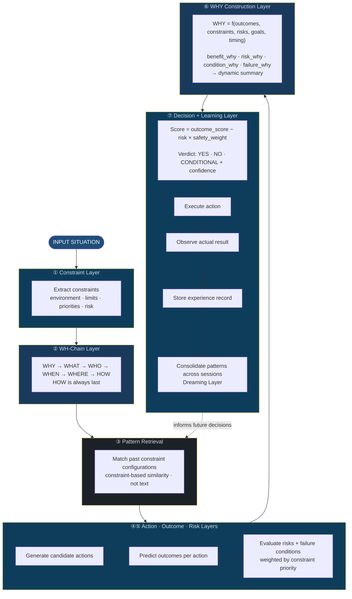
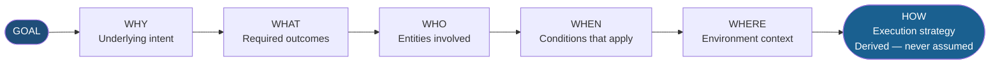
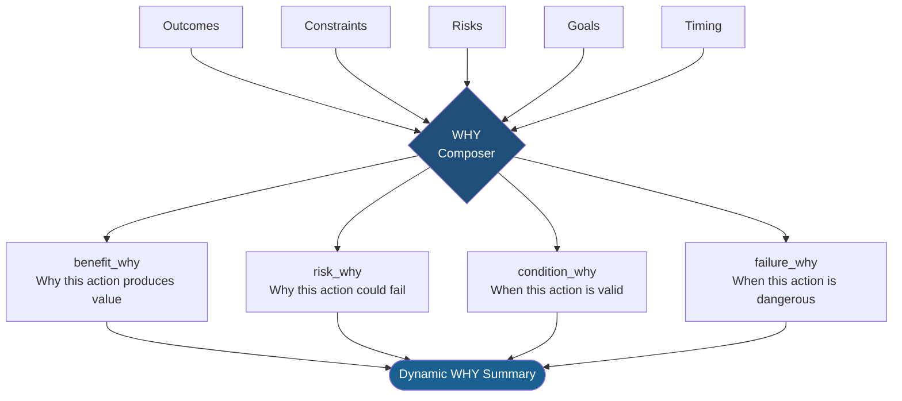
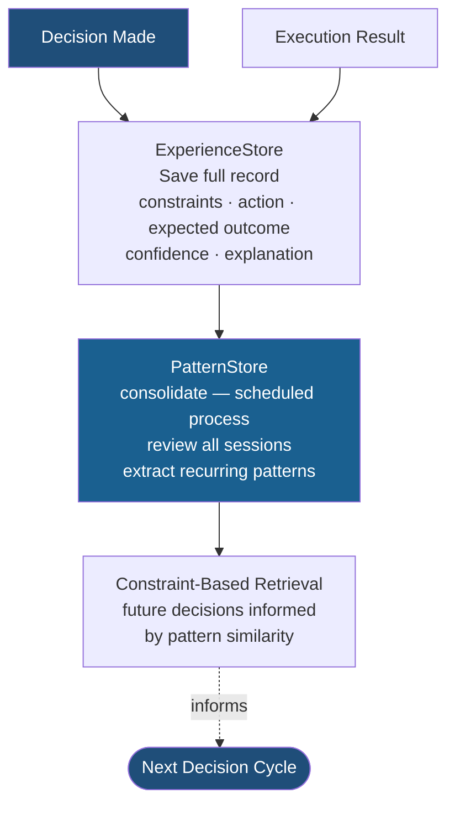
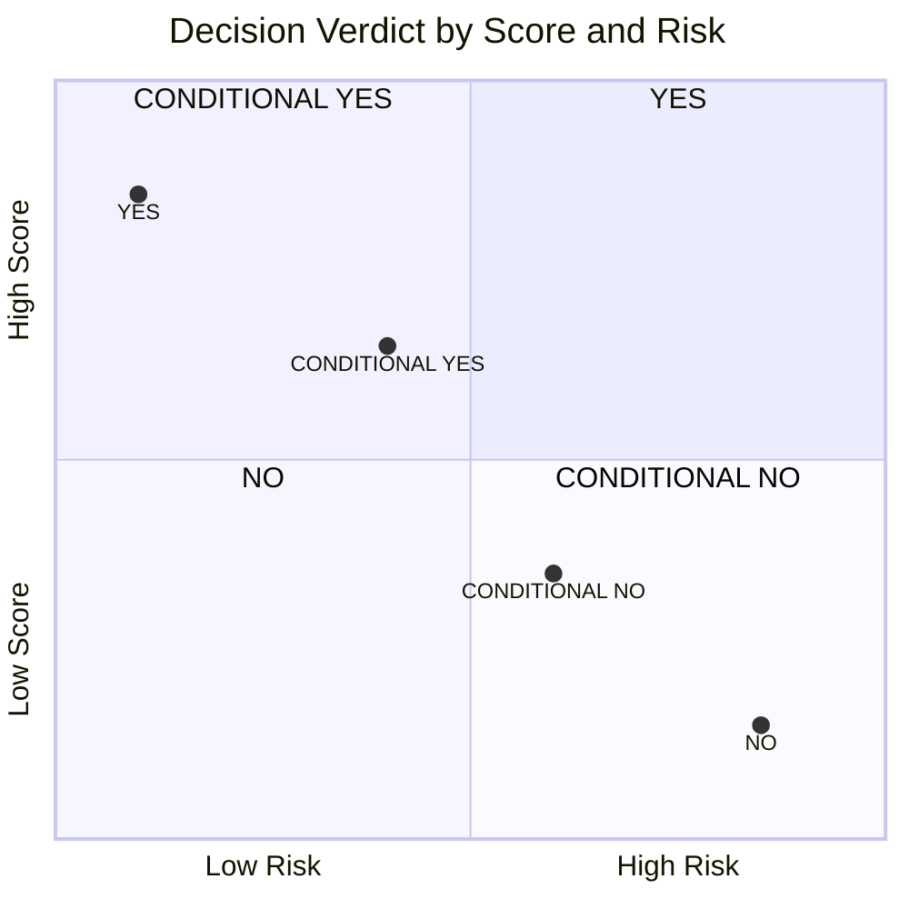

# CDRS — Full System Overview (Mermaid)

GitHub-native diagrams. Renders inline on any Markdown viewer.

---

## Complete Decision Cycle

---

## WH-Chain Detail

---

## WHY Composition

---

## Memory and Learning

---

## Verdict Matrix

