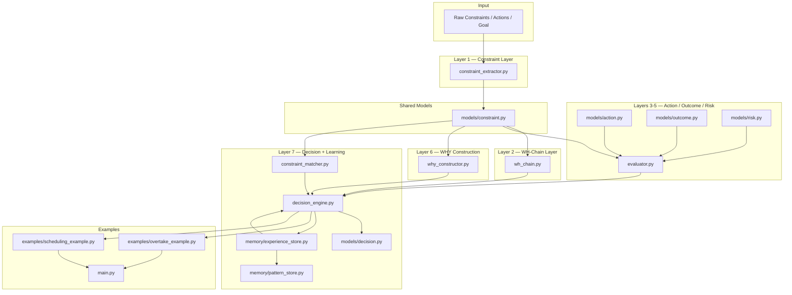

# CDRS Prototype — Module Map

How all Python files in the prototype relate to each other.

---

## Dependency Rules

- `models/` has no internal dependencies — pure data classes
- `engine/` depends on `models/` only
- `memory/` depends on `models/` only
- `engine/decision_engine.py` depends on all other engine modules + memory
- Examples depend only on `engine/decision_engine.py` and `models/`
- No circular dependencies

## Entry Points

| File | Purpose |
|---|---|
| `prototype/main.py` | Run both example scenarios |
| `prototype/examples/overtake_example.py` | Driving decision demo |
| `prototype/examples/scheduling_example.py` | Task scheduling demo |
| `prototype/memory/pattern_store.py` | Trigger pattern consolidation manually |
